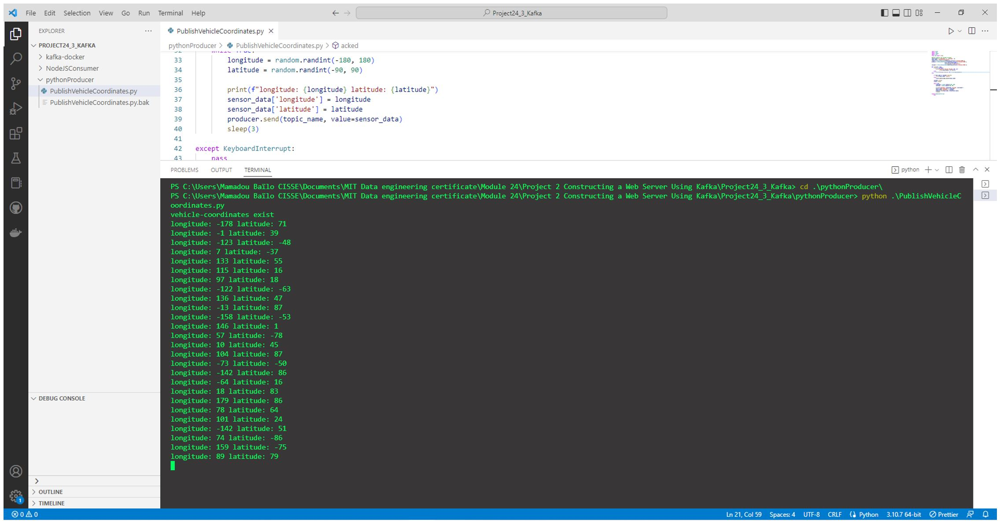

In this project, we will be working with `Kafka`, one of the most successful applications for handling streaming data at scale. We will use a Docker image created by Confluent that installs all of the necessary Kafka components including, among others, the `broker` and `ZooKeeper`. Kafka allows us to store messages in `topics`, which are distributed across multiple brokers by splitting topics into data partitions that save us from unfortunate broker failures.

To get started with this project, we will begin with a simple Kafka implementation. With this implementation, we will create a `Python application` that publishes vehicle location longitude-latitude data to a Kafka topic. Next, we will use Node.js to start a `web server` that acts as a consumer for the messages received from the Kafka application.

1. Download and extract the `Project 24_3_Kafka` folder


2. Open your Docker Desktop. Select the gear icon on the top right of the Docker Desktop window, then select Resources. Ensure that your CPU and memory are both set to a minimum of 6 GB.
For windows users :
Inside your user home folder: `C:\Users\”YOUR_WINDOWS_USERNAME”`, create a new file titled .wslconfig. Copy and and paste the following lines of code inside of the `.wslconfig` file:

```
[wsl2]
memory=8GB # Limits VM memory in WSL 2 
processors=4 # Makes the WSL 2 VM use 4 virtual processors
localhostForwarding=true # Boolean specifying if ports bound to wildcard or localhost in the WSL 2 VM should be connectable from the host via localhost:port.
```


3. Next, you will create the Kafka Docker container components. Navigate to the kafka-docker folder inside the Project24_3_Kafka folder. In a Terminal window, run the following command to initialize your Kafka container:
```
docker-compose up
```

Open the Docker Desktop and confirm that all of the required Kafka container components are now up and running. The nine required container components are: `zookeeper`, `broker`, `schema-registry`, `rest-proxy`, `connect`, `ksqlbd-server`, `ksql-datagen`, `ksqlbd-cli`, and `control-center`.


4. Open your browser and navigate to the following URL: http://localhost:9021. This is the Confluent Control Center, and it will allow you to check the status of the Kafka cluster that you spun up.


5. Navigate to the `Topics` list on the Confluent Control Center by selecting `“Topics”` in the controlcenter.cluster in the Confluent Control Center.


6. Next, you will be writing Python code to simulate an IoT device that publishes the longitude and latitude coordinates of vehicles’ locations to Kafka. From http://localhost:9021, select Topics and then select “Add a topic”. Title the new topic `vehicle-coordinates`, set the number of partitions to 1, and select “Create with default settings”.


7. From the command prompt, run the following command to install the Kafka Python client:
```
pip install kafka-python
```


8. In VS Code, open the `PublishVehicleCoordinates.py` file inside the `pythonProducer` folder. Paste the code below into the file to create the template to define the producer:

```python
import kafka
import time
import random
import json
from time import sleep
#define producer and consumer variable
sensor_data = {'longitude': 0, 'latitude': 0}
topic_name = ????
client = kafka.KafkaClient(bootstrap_servers=['localhost:9092'])
producer = kafka.KafkaProducer(bootstrap_servers=['localhost:9092'],
                         value_serializer=lambda x: 
                         json.dumps(x).encode('utf-8'))
consumer = kafka.KafkaConsumer(bootstrap_servers=['localhost:9092'])

def acked(err, msg):
    if err is not None:
        print("Failed to deliver message: {0}: {1}"
              .format(msg.value(), err.str()))
    else:
        print("Message produced: {0}".format(msg.value()))

try:
   
    if topic_name in consumer.topics():
         print(topic_name+" exist")
    else:
        client.ensure_topic_exists(topic_name)

    consumer.close()
    client.close()

    while True:
        longitude = ????
        latitude = ????
        
        print(f"longitude: {longitude} latitude: {latitude}")
        sensor_data['longitude'] = ????
        sensor_data['latitude'] = ????
        producer.send(topic_name, value=????)
        sleep(3)

except KeyboardInterrupt:
    pass
```

9. Modify the code in the `PublishVehicleCoordinates.py` file as instructed below:

  * Set the `topic_name` variable equal to a string with the `vehicle-coordinates` value.

  * In the while loop, use the correct NumPy function to simulate random integer values for the `longitude` and the `latitude`. The values for longitude should be random integers between −180 and 180. The values for `latitude` should be random integers between −90 and 90.

```python
import kafka
import time
import random
import json
from time import sleep

#define producer and consumer variable
sensor_data = {'longitude': 0, 'latitude': 0}
topic_name = "vehicle-coordinates"
client = kafka.KafkaClient(bootstrap_servers=['localhost:9092'])
producer = kafka.KafkaProducer(bootstrap_servers=['localhost:9092'],
                         value_serializer=lambda x: 
                         json.dumps(x).encode('utf-8'))
consumer = kafka.KafkaConsumer(bootstrap_servers=['localhost:9092'])

def acked(err, msg):
    if err is not None:
        print("Failed to deliver message: {0}: {1}"
              .format(msg.value(), err.str()))
    else:
        print("Message produced: {0}".format(msg.value()))
try:
   
    if topic_name in consumer.topics():
         print(topic_name+" exist")
    else:
        client.ensure_topic_exists(topic_name)

    consumer.close()
    client.close()

    while True:
        longitude = random.randint(-180, 180)
        latitude = random.randint(-90, 90)
        
        print(f"longitude: {longitude} latitude: {latitude}")
        sensor_data['longitude'] = longitude
        sensor_data['latitude'] = latitude
        producer.send(topic_name, value=sensor_data)
        sleep(3)

except KeyboardInterrupt:
    pass
```

10. From the Terminal window, run the code in the `PublishVehicleCoordinates.py` file to produce the longitude and latitude data.



11. Install Node.js
From the command prompt, run the command below to verify that Node.js is installed:
```
node --version
```


12. Now you will write a Node.js web page to consume the location data produced by the PublishVehicleCoordinates.py code. Move the PublishVehicleCoordinates.py file inside the NodeJSConsumer folder. Modify the server.js file inside the NodeJSConsumer folder as follows:

  * Change the topic to `vehicle-coordinates`.
  * Change the HTML code on line 19 to display the `Consume Vehicle Coordinates` value.
  * Save the file.

```javascript
const express = require('express');
const consumer = require("./myconsumer");
const app = express()

app.use(express.json());
let options = {
    dotfiles: "ignore",
    redirect:false
}

app.use(express.static('public',options))

app.get("/",(req,res)=>{
    var response = `
    <html>
        <h1>Confluence Kafka REST</h1>
        <div>
        <form action="/consumer" method="get" >
            <input type="submit" value="Consume Vehicle Coordinates"/>
        </form>
        </div>
    </html>`
res.send(response)
}
)
app.get("/consumer", (req,res)=>{
    let topic = "vehicle-coordinates"
    response = consumer.myconsumer({topic:topic})
    res.send("Success- Consumed: " +topic);
})


app.listen(5000,()=>console.log('Listening on 5000'))
```

13. In a Terminal window, run the following command to install the Kafka JavaScript library. This will be used to consume Kafka messages in your Node.js web application.
```
npm install node-rdkafka
```


14.  In a Terminal window, navigate to the `Project24_3` folder. Start the web page by running the following command:
```
node server.js
```


15.  Navigate to http://localhost:5000. Your web page should be titled “Confluence Kafka REST” and have a button labeled “Consume Vehicle Coordinates”.


16.  Select the “Consume Vehicle Coordinates” button to verify that your data is being consumed and that there are no errors.


Congratulations :clap:
You have created a producer/consumer pair for handling IoT data. Kafka can handle large volumes of data that could potentially be generated in an environment like this. It is also fault tolerant. That is, it would continue to operate properly in the event of the failure of one or more of its components.

